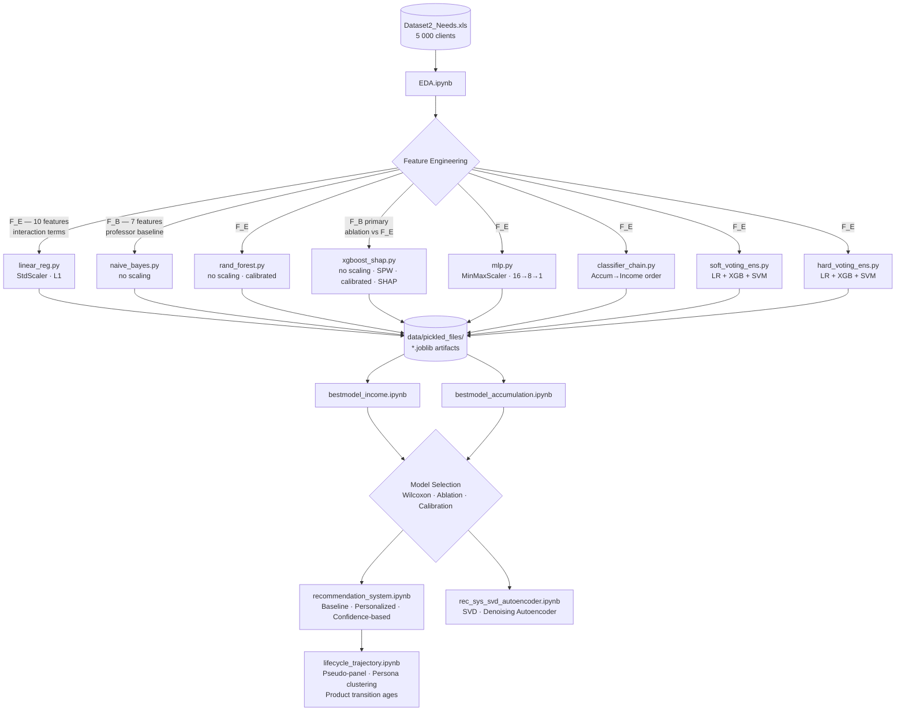

<!--  ═══════════════════════════════════════════════════════════════════════
      BusinessCase2 — Investment Needs Estimation & Recommendation System
      Politecnico di Milano · Fintech Group Project 2
      ═══════════════════════════════════════════════════════════════════════ -->

<div align="center">

```
╔══════════════════════════════════════════════════════════════════════════╗
║                                                                          ║
║    DATA-DRIVEN INVESTMENT NEEDS ESTIMATION                               ║
║    AND PERSONALIZED RECOMMENDATION SYSTEM                                ║
║                                                                          ║
║    Politecnico di Milano  ·  Fintech Group Project 2                     ║
║    Marco Amarilli · Tommaso Baresi · Giulia Talà                         ║
║    Alberto Toia · Simone Zani                                            ║
║                                                                          ║
╚══════════════════════════════════════════════════════════════════════════╝
```


</div>

---

## Overview

An end-to-end **KYC (Know Your Client) pipeline** for wealth management, built around MiFID II compliance as its organizing principle.  
Given 5 000 anonymized clients, we:

1. **Estimate** two investment need types as calibrated propensity scores via binary classifiers  
2. **Select** the best model per target using nested 10-fold cross-validation + Wilcoxon tests  
3. **Recommend** products ranked by confidence-weighted suitability under a hard regulatory risk cap

> Labels derive from a **revealed-preference** scheme: if a trusted advisor sold a product matching a given need type and the client purchased it, we infer the client held that need.


## Repository Structure

```
BusinessCase2/
│
├── Data/
│   └── Dataset2_Needs.xls          ← raw dataset (5 000 clients, never modified)
│
├── data/
│   └── pickled_files/              ← generated model artifacts
│       ├── linear_reg/
│       ├── naive_bayes/
│       ├── rand_forest/
│       ├── xgboost_shap/
│       ├── mlp/
│       ├── classifier_chain/
│       ├── soft_voting_ens/
│       └── hard_voting_ens/
│
├── utils/                          ← shared modules
│   ├── preprocessing.py            ← feature engineering, splits, CV, calibration
│   ├── next_best_action.py         ← baseline / personalized / confidence approaches
│   ├── products.py                 ← product catalogue & interaction matrix
│   ├── svd_rec.py                  ← truncated SVD collaborative filter
│   ├── autoencoder_rec.py          ← denoising autoencoder collaborative filter
│   ├── linear_reg.py
│   ├── naive_bayes.py
│   ├── rand_forest.py
│   ├── xgboost_shap.py
│   ├── mlp.py
│   ├── classifier_chain.py
│   ├── soft_voting_ens.py
│   └── hard_voting_ens.py
│
├── EDA.ipynb                       ← exploratory data analysis
├── bestmodel_income.ipynb          ← model comparison for IncomeInvestment
├── bestmodel_accumulation.ipynb    ← model comparison for AccumulationInvestment
├── recommendation_system.ipynb     ← NBA layer: baseline / personalized / confidence-based
├── rec_sys_svd_autoencoder.ipynb   ← collaborative filtering: SVD & denoising autoencoder
├── lifecycle_trajectory.ipynb      ← longitudinal view: product transitions across age
│
├── pyproject.toml
└── README.md
```

---

## Pipeline Architecture



---

## How to Run

### 1. Install dependencies

```bash
cd BusinessCase2
uv sync          # installs all dependencies from pyproject.toml
```

### 2. Run the notebooks

Open the notebooks in this order:

```text
EDA.ipynb                       ← exploratory data analysis (optional, no outputs consumed downstream)
bestmodel_income.ipynb          ← IncomeInvestment model selection → populates pickled_files/
bestmodel_accumulation.ipynb    ← AccumulationInvestment model selection → populates pickled_files/
recommendation_system.ipynb     ← NBA layer (Baseline / Personalized / Confidence-based)
rec_sys_svd_autoencoder.ipynb   ← collaborative filtering (SVD + denoising autoencoder)
lifecycle_trajectory.ipynb      ← longitudinal product trajectories by client persona
```

`bestmodel_*.ipynb` produce per-target:
- Summary metrics table (accuracy / precision / recall / F1)
- CV stability boxplots (10-fold F1 distributions)
- Wilcoxon signed-rank p-value matrix
- Ablation table: `delta_F1 = F_E − F_B`
- MiFID II PR-curve threshold selection
- Calibration: Brier scores pre/post + reliability diagrams
- Label sensitivity: F1 at 5% and 10% label corruption
- Confusion matrix for the winning model
- SHAP global feature importances (from XGBoost pickle)


## Pickle Format

Every `utils/*.py` script saves results to `data/pickled_files/<model>/` as a `pickle` dict:

```python
{
    'model':                <fitted estimator or torch state_dict>,
    'scaler':               <StandardScaler | MinMaxScaler | None>,
    'cv_metrics_raw':       {'f1': [10 floats], 'precision': [...], ...},
    'cv_metrics_summary':   {'f1': {'mean': float, 'std': float}, ...},
    'test_metrics':         {'accuracy': float, 'precision': float, 'recall': float, 'f1': float},
    'y_test_true':          np.ndarray,
    'y_test_pred':          np.ndarray,
    'feature_names':        list[str],
    'target_name':          str,
    'model_name':           str,
    'ablation':             {'engineered': {...}, 'baseline': {...}},
    'threshold_info':       {'threshold': float, 'precision': float, 'recall': float, 'f1': float, ...},
    'brier_score':          float,           # post-calibration
    'brier_score_pre_cal':  float | None,    # RF and XGBoost only
    # model-specific extras:
    'shap_values':          np.ndarray,      # xgboost_shap only
    'feature_importances':  np.ndarray,      # RF and XGBoost
    'model_architecture':   str,             # MLP only
}
```

---

<div align="center">

*Politecnico di Milano · Fintech Course · A.Y. 2024–25*

</div>
