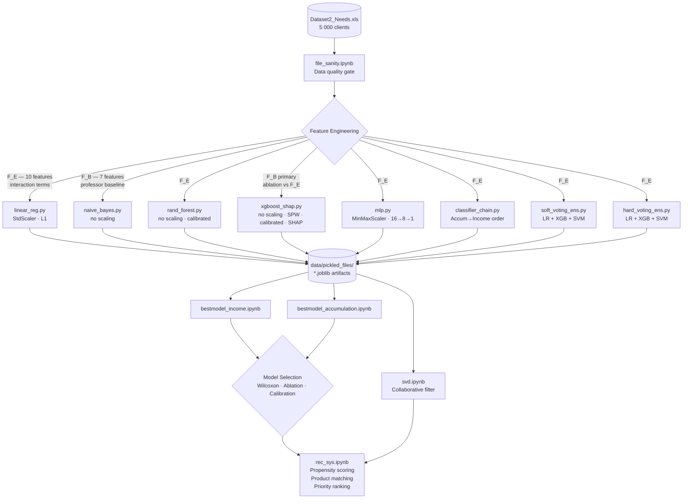

<!--  ═══════════════════════════════════════════════════════════════════════
      BusinessCase2 — Investment Needs Estimation & Recommendation System
      Politecnico di Milano · Fintech Group Project 2
      ═══════════════════════════════════════════════════════════════════════ -->

<div align="center">

```
╔══════════════════════════════════════════════════════════════════════════╗
║                                                                          ║
║    DATA-DRIVEN INVESTMENT NEEDS ESTIMATION                               ║
║    AND PERSONALIZED RECOMMENDATION SYSTEM                                ║
║                                                                          ║
║    Politecnico di Milano  ·  Fintech Group Project 2                     ║
║    Marco Amarilli · Tommaso Baresi · Giulia Talà                         ║
║    Alberto Toia · Simone Zani                                            ║
║                                                                          ║
╚══════════════════════════════════════════════════════════════════════════╝
```


</div>

---

## Overview

An end-to-end **KYC (Know Your Client) pipeline** for wealth management, built around MiFID II compliance as its organizing principle.  
Given 5 000 anonymized clients, we:

1. **Estimate** two investment need types as calibrated propensity scores via binary classifiers  
2. **Select** the best model per target using nested 10-fold cross-validation + Wilcoxon tests  
3. **Recommend** products ranked by confidence-weighted suitability under a hard regulatory risk cap

> Labels derive from a **revealed-preference** scheme: if a trusted advisor sold a product matching a given need type and the client purchased it, we infer the client held that need.

---

## Investment Targets

| Target | Prevalence | Interpretation | Primary metric driver |
|--------|-----------|---------------|----------------------|
| **IncomeInvestment** | 38% | Lump-sum capital deployment for cash flow — retirement-oriented clients | Recall (missed needs = lost revenue) |
| **AccumulationInvestment** | 51% | Systematic dollar-cost averaging — working-age clients | Precision (false positives = MiFID II mis-selling risk) |

The two targets have correlation **r = 0.011** — empirically near-independent, validating separate binary classifiers over a multi-output approach.

---

## Repository Structure

```
BusinessCase2/
│
├── Data/
│   └── Dataset2_Needs.xls          ← raw dataset (5 000 clients, never modified)
│
├── data/
│   └── pickled_files/              ← generated model artifacts (gitignored)
│       ├── linear_reg/
│       ├── naive_bayes/
│       ├── rand_forest/
│       ├── xgboost_shap/
│       ├── mlp/
│       ├── classifier_chain/
│       ├── soft_voting_ens/
│       └── hard_voting_ens/
│
├── utils/                          ← one self-contained script per model
│   ├── preprocessing.py            ← shared foundation (F_E, F_B, splits, CV, calibration)
│   ├── linear_reg.py
│   ├── naive_bayes.py
│   ├── rand_forest.py
│   ├── xgboost_shap.py
│   ├── mlp.py
│   ├── classifier_chain.py
│   ├── soft_voting_ens.py
│   └── hard_voting_ens.py
│
├── file_sanity.ipynb               ← data quality gate (run first)
├── bestmodel_income.ipynb          ← model comparison for IncomeInvestment
├── bestmodel_accumulation.ipynb    ← model comparison for AccumulationInvestment
├── rec_sys.ipynb                   ← recommendation engine
├── svd.ipynb                       ← SVD collaborative filter
├── data_assumptions.ipynb          ← statistical assumption tests
├── EstimatingNeedsPoliMI.ipynb     ← EDA (reference, unchanged)
│
├── AT_comments.md                  ← design decisions & source of truth
├── pyproject.toml
└── README.md
```

---

## Pipeline Architecture



---

## Model Catalogue

| Tier | Script | Model | Features | Scaling | Special |
|------|--------|-------|----------|---------|---------|
| 1 | `linear_reg.py` | Logistic Regression (L1) | **F_E** | StandardScaler | `class_weight='balanced'` for Income |
| 1 | `naive_bayes.py` | Gaussian Naive Bayes | **F_B** | None | Bayesian priors handle imbalance |
| 2 | `rand_forest.py` | Random Forest (n=100) | F_E | None | Isotonic calibration |
| 2 | `xgboost_shap.py` | XGBoost + SHAP | **F_B** | None | `scale_pos_weight` for Income · Isotonic cal. · SHAP TreeExplainer |
| 3 | `mlp.py` | MLP `input→16→8→1` | F_E | MinMaxScaler | BatchNorm · Dropout(0.2) · ReduceLROnPlateau |
| 4 | `classifier_chain.py` | ClassifierChain(XGBoost) | F_E | MinMaxScaler | Chain order: **Accum → Income** (life-cycle prior) |
| 4 | `soft_voting_ens.py` | Soft Voting: LR+XGB+SVM | F_E | Per-estimator Pipelines | Best-performing model |
| 4 | `hard_voting_ens.py` | Hard Voting: LR+XGB+SVM | F_E | Per-estimator Pipelines | Comparison baseline for soft voting |

### Feature Sets

```
F_B (professor baseline, 7 features)          F_E (our engineered set, 10 features)
──────────────────────────────────────         ──────────────────────────────────────
Age                                            Age
Gender                                         Age²               ← nonlinear lifecycle
FamilyMembers                                  Age × log(Wealth)  ← r=0.45 with Income target
FinancialEducation                             FinancialEducation
RiskPropensity                                 RiskPropensity
log(1 + Income)                                FinEdu × RiskProp  ← sophisticated investor
log(1 + Wealth)                                log(1 + Income)
                                               log(1 + Wealth)
                                               log(1 + Income/FM) ← per-capita income
                                               log(1 + Wealth/FM) ← per-capita wealth
```

> **Why separate feature sets?** Tree models (XGBoost, RF) learn interactions natively — pre-computing them adds correlated features that dilute SHAP importances without lifting F1. Logistic Regression cannot learn interactions; `F_E` provides significant, statistically verified lift (Wilcoxon p < 0.05). NaiveBayes uses `F_B` only: adding interactions compounds the independence assumption violation.

---

## Evaluation Design

### MiFID II constraints
- **Primary metric**: F1-score (balanced precision–recall)
- **Hard constraint**: Precision ≥ 0.75 on all positive recommendations (MiFID II compliance)
- **Threshold selection**: PR-curve optimisation, not fixed at 0.5

### Statistical framework
- **Outer loop**: 10-fold stratified CV (5 folds → minimum achievable p ≈ 0.063, structurally failing α = 0.05)
- **Model comparison**: Wilcoxon signed-rank test on 10 outer-fold F1 scores
- **Tie-breaking**: Occam's razor selects the simpler model when p > 0.05
- **Calibration**: Isotonic regression for RF and XGBoost; Brier score pre/post

### Imbalance handling
| Target | Prevalence | Correction |
|--------|-----------|-----------|
| IncomeInvestment | 38% | `class_weight='balanced'` (LR, SVM); `scale_pos_weight=neg/pos` (XGBoost) |
| AccumulationInvestment | 51% | None — correction would degrade a non-problem |

---

## How to Run

### 1. Install dependencies

```bash
cd BusinessCase2
uv sync          # installs all dependencies from pyproject.toml
```

### 2. Run the data sanity gate

```bash
# Open and run all cells — every assertion must pass before proceeding
jupyter notebook file_sanity.ipynb
```

### 3. Train all models

Each script is fully independent and can be run in any order or in parallel:

```bash
python -m utils.linear_reg
python -m utils.naive_bayes
python -m utils.rand_forest
python -m utils.xgboost_shap      # also computes SHAP values
python -m utils.mlp                # ~10 min on CPU (10-fold × 2 targets × 100 epochs)
python -m utils.classifier_chain
python -m utils.soft_voting_ens
python -m utils.hard_voting_ens
```

Expected output per script:
```
utils.linear_reg — INFO — Target: IncomeInvestment
utils.linear_reg — INFO —   [F_E, L1] CV F1: 0.XXX ± 0.XXX
utils.linear_reg — INFO —   [F_E, L1] Test F1 (thr=0.5): 0.XXX
utils.linear_reg — INFO —   [F_E, L1] Brier score: 0.XXXX
utils.linear_reg — INFO —   [F_B, L1] Test F1: 0.XXX  (delta F_E−F_B = +0.XXX)
utils.linear_reg — INFO — Saved: data/pickled_files/linear_reg/incomeInvestment.joblib
```

### 4. Analyse results

Open the notebooks in this order:

```
bestmodel_income.ipynb          ← IncomeInvestment model selection
bestmodel_accumulation.ipynb    ← AccumulationInvestment model selection
```

Each notebook loads all pickled results and produces:
- Summary metrics table (accuracy / precision / recall / F1)
- CV stability boxplots (10-fold F1 distributions)
- Wilcoxon signed-rank p-value matrix
- Ablation table: `delta_F1 = F_E − F_B`
- MiFID II PR-curve threshold selection
- Calibration: Brier scores pre/post + reliability diagrams
- Label sensitivity: F1 at 5% and 10% label corruption
- Confusion matrix for the winning model
- SHAP global feature importances (from XGBoost pickle)

### 5. Recommendation system

```
rec_sys.ipynb    ← update BEST_MODELS dict with winners from step 4
```

The notebook loads the winning model pickles (including pre-computed SHAP values) and implements the three-stage recommendation engine:
- **Stage 1**: Propensity scoring → confidence segmentation
- **Stage 2**: Product matching via mean-variance suitability function (hard risk cap)
- **Stage 3**: Priority ranking by `propensity × suitability`

### 6. Supporting notebooks (for teammates)

```
svd.ipynb              ← SVD collaborative filter (Simone)
data_assumptions.ipynb ← normality, homoscedasticity, VIF tests (Simone & Marco)
```

---

## Key Design Rationale

### Why not a uniform preprocessing pipeline?

| Model | Scaler | Reason |
|-------|--------|--------|
| Logistic Regression | **StandardScaler** | L1/L2 regularisation penalty is proportional to coefficient magnitude; MinMaxScaler preserves unequal variances causing incomparable effective penalties at the same λ |
| Gaussian Naive Bayes | **None** | GNB likelihood ratio depends only on within-class distributions; rescaling changes μ and σ proportionally, leaving the ratio invariant |
| SVM (RBF) | **MinMaxScaler** | RBF kernel measures Euclidean distance; a feature in [18,97] contributes up to 6241 to squared distance vs 1 for a [0,1] feature |
| Random Forest / XGBoost | **None** | Threshold splits `x > t` are invariant to any strictly monotonic transformation |
| MLP | **MinMaxScaler** | Heterogeneous scales slow gradient descent; [0,1] matches the Sigmoid output activation |

### Why the Soft Voting Ensemble wins

The three components fail in **structurally different regimes**:
- LR fails when the decision boundary is nonlinear
- XGBoost is sensitive to distribution shift and outliers
- SVM (RBF) fails when classes are not separable in kernel space

Because their errors are partially uncorrelated, averaging their **calibrated** probabilities reduces total generalisation error. Soft voting retains full probability information; hard voting discards it before aggregation.

### Life-cycle hypothesis — empirical confirmation

```
IncomeInvestment signal:           AccumulationInvestment signal:
─────────────────────────          ──────────────────────────────
Age              r = 0.33          Income_log        r = 0.32
Wealth_log       r = 0.40          Wealth_log        r = 0.12
Age × Wealth_log r = 0.45  ◄─ strongest   RiskPropensity    r = 0.07
```

The `Age_x_Wealth` interaction (r = 0.45) outperforms either marginal predictor alone, confirming that the elderly-wealthy joint signal is the dominant driver of income investment needs — a direct empirical validation of the Modigliani life-cycle hypothesis.

---

## Dependencies

| Package | Version | Purpose |
|---------|---------|---------|
| `scikit-learn` | ≥ 1.4 | Models, calibration, CV |
| `xgboost` | ≥ 2.0 | Gradient boosting + SHAP base |
| `shap` | ≥ 0.45 | TreeExplainer for interpretability |
| `torch` | ≥ 2.2 | MLP implementation |
| `scipy` | ≥ 1.12 | Wilcoxon signed-rank test |
| `statsmodels` | ≥ 0.14 | VIF, Q-Q plots in `data_assumptions.ipynb` |
| `joblib` | ≥ 1.3 | Model serialisation (`compress=3`) |
| `xlrd` | ≥ 2.0 | **Critical** — `pd.read_excel` for `.xls` format requires xlrd |
| `pandas` | ≥ 2.0 | Data manipulation |
| `numpy` | ≥ 2.0 | Numerical computing |
| `matplotlib` / `seaborn` | ≥ 3.8 / ≥ 0.13 | Visualisation |

> **Note on `xlrd`**: The dataset is `.xls` (legacy Excel format). `pandas.read_excel` silently fails without `xlrd` installed. It is listed explicitly in `pyproject.toml` to prevent this.

---

## Pickle Format

Every `utils/*.py` script saves results to `data/pickled_files/<model>/` as a `joblib` dict:

```python
{
    'model':                <fitted estimator or torch state_dict>,
    'scaler':               <StandardScaler | MinMaxScaler | None>,
    'cv_metrics_raw':       {'f1': [10 floats], 'precision': [...], ...},
    'cv_metrics_summary':   {'f1': {'mean': float, 'std': float}, ...},
    'test_metrics':         {'accuracy': float, 'precision': float, 'recall': float, 'f1': float},
    'y_test_true':          np.ndarray,
    'y_test_pred':          np.ndarray,
    'feature_names':        list[str],
    'target_name':          str,
    'model_name':           str,
    'ablation':             {'engineered': {...}, 'baseline': {...}},
    'threshold_info':       {'threshold': float, 'precision': float, 'recall': float, 'f1': float, ...},
    'brier_score':          float,           # post-calibration
    'brier_score_pre_cal':  float | None,    # RF and XGBoost only
    # model-specific extras:
    'shap_values':          np.ndarray,      # xgboost_shap only
    'feature_importances':  np.ndarray,      # RF and XGBoost
    'model_architecture':   str,             # MLP only
}
```

---

<div align="center">

*Politecnico di Milano · Fintech Course · A.Y. 2024–25*

</div>
